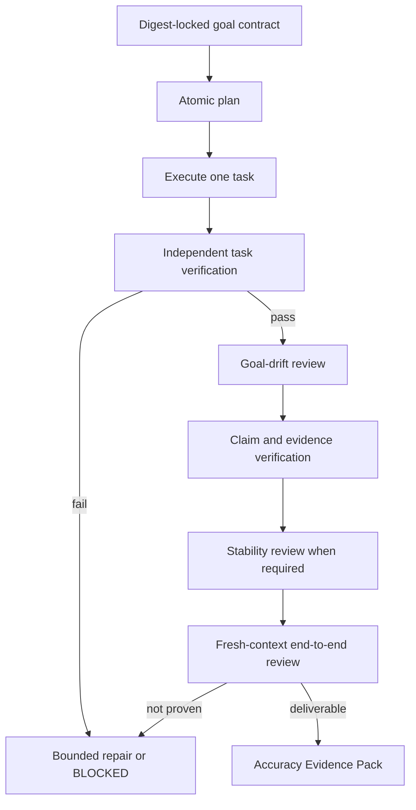

# Loop Engineering

**Ship a verified outcome—not a run that merely looks finished.**

Loop Engineering is a deterministic runtime for long-running AI work. It locks the approved goal, converts it into atomic tasks, verifies every task independently, detects drift, recovers within explicit limits, and delivers either an evidence-backed result or the exact reason it stopped.

## Run the verified demo

Requires Python 3.11+.

```bash
git clone https://github.com/Abhillashjadhav/loop-engineering.git
cd loop-engineering
python -m venv .venv && source .venv/bin/activate
pip install -e ".[dev]"

loop-engineering audit-github \
  --subjects examples/subjects.synthetic.yaml \
  --fixtures evals/fixtures/github

cat outputs/github-authority-audit-synthetic/accuracy-evidence.md
```

The demo is offline, deterministic, and based on visibly synthetic GitHub fixtures. It demonstrates the execution and verification runtime; it is not a live judgment of any person or repository.

## What you receive

A successful goal does not end with `completed=true`. It produces an **Accuracy Evidence Pack**:

```text
outputs/<goal-id>/
├── final-output.md
├── accuracy-evidence.md
├── accuracy-evidence.json
├── claim-evidence-matrix.csv
├── verification-results.json
├── end-to-end-review.json
├── unresolved-uncertainties.md
└── learning-receipt.md
```

The pack answers:

1. What outcome was requested?
2. Which tasks were executed and independently verified?
3. Which claims have sufficient evidence?
4. Did the work drift from the locked goal?
5. What remains uncertain?
6. Is the final output actually deliverable?

## The failure it prevents

A normal agent loop can finish every planned action and still fail the real goal:

```text
Goal: produce a trustworthy portfolio assessment

Completed-looking run:
✓ fetched some repositories
✓ generated scores
✓ wrote a report

Hidden failures:
✗ missed pagination
✗ trusted README claims as independent evidence
✗ executor graded its own work
✗ changed the question during execution
✗ crashed after writing output but before verification
```

Loop Engineering treats those as runtime failures—not postmortem lessons.

## How the runtime works



### Four verification loops

| Loop | Question | Hard rule |
|---|---|---|
| **Task verification** | Did this task actually produce the declared artifact and evidence? | The executor cannot verify its own work |
| **Goal-drift review** | Does the evolving plan still cover the locked goal without orphan work? | Drift beyond the contract threshold stops execution |
| **Evidence verification** | Are material claims independently supported? | Self-description alone is not corroboration |
| **Stability review** | Does the conclusion survive reordered sources and independent variants? | Disagreement is preserved, not averaged away |

A fresh-context end-to-end reviewer then checks both process completeness and goal match.

## Runtime guarantees

- **Locked goal:** a canonical digest exposes any silent mutation.
- **Atomic execution:** only one task can be in flight.
- **Independent verification:** executor narration is never evidence.
- **Crash-safe resume:** verified work is preserved; unverified work is repeated.
- **Bounded recovery:** retry budgets and circuit breakers prevent endless loops.
- **No false completion:** interrupted, incomplete, or unsupported runs cannot ship as success.
- **Evidence-backed delivery:** claims, uncertainties, reviews, and learning are preserved with the output.

The runtime North Star is `human_active_minutes_saved_per_successfully_verified_goal`. Speed without verified completion earns no credit.

## General workflow

```bash
# Lock the draft contract
loop-engineering init examples/goal.synthetic.yaml

# Inspect the atomic plan
loop-engineering plan github-authority-audit-synthetic \
  --fixtures evals/fixtures/github

# Approve once, then execute autonomously
loop-engineering run github-authority-audit-synthetic \
  --fixtures evals/fixtures/github

# Inspect, re-verify, report, or safely resume
loop-engineering status <run-id>
loop-engineering verify <run-id>
loop-engineering report <run-id>
loop-engineering resume <run-id>
```

A goal contract defines the outcome, deliverables, metrics, scope, exclusions, allowed and forbidden actions, evidence requirements, budgets, stop conditions, escalation rules, and approval record.

## Included use cases

### Public GitHub Authority Audit

The bundled synthetic use case demonstrates identity checks, honest inventory, repository-level evidence scoring, portfolio aggregation, six-variant stability, and a complete evidence pack. Live retrieval is deliberately outside the deterministic Python runtime.

### Personal Chief of Staff

A private-data workflow for source-backed task discovery, prioritization, briefs, safe scheduling proposals, and approval-gated actions.

```bash
loop-engineering chief-of-staff status
loop-engineering chief-of-staff tasks
loop-engineering chief-of-staff brief morning
loop-engineering chief-of-staff schedule
```

See [`use_cases/personal-chief-of-staff/README.md`](use_cases/personal-chief-of-staff/README.md).

## Loop Engineering and Graph Engineering

Loop Engineering and Graph Engineering address different reliability boundaries.

| Layer | Use it for | Reliability contract |
|---|---|---|
| **Loop Engineering** | One durable autonomous unit pursuing one locked outcome | Atomic execution, independent verification, drift detection, bounded recovery, crash-safe resume, and evidence-backed completion |
| **Graph Engineering** | Multiple guarded loops or workers that must branch, exchange typed state, and converge | Explicit topology, typed handoffs, permissions, budgets, conditional edges, deterministic joins, failure routing, and accountable approval gates |

Use one loop when the work has one objective and one recurring context. Use a graph when independently verifiable branches must run separately and their outputs must satisfy an explicit join policy before the workflow can proceed.

A graph does not replace the loop. A graph node may itself be a guarded loop: the loop makes each autonomous unit reliable; the graph makes coordination between units reliable.

The shipped [`agent-graph-designer`](https://github.com/Abhillashjadhav/AI-PM-essential-skills/tree/main/agent-graph-designer) plugin qualifies `LOOP_SUFFICIENT` versus `GRAPH_REQUIRED` and produces a machine-readable graph contract, synchronized architecture, vendor-neutral runner skeleton, bounded recovery rules, and a named human approval boundary.

> **Keep the loop; engineer the graph around it.**

## Use Loop Engineering when

- work spans many tasks and can drift while executing;
- failure can hide behind a plausible final answer;
- evidence and provenance matter as much as the output;
- a run must survive interruption without skipping work;
- autonomous recovery needs explicit limits;
- stakeholders need to inspect why the result should be trusted.

## Do not use it when

- a single deterministic script is enough;
- the task has no verifiable success condition;
- you only need a conversational agent framework;
- you expect the runtime to invent live connectors or domain logic automatically.

Loop Engineering supplies the execution and verification spine. Each domain still needs a bounded use-case module that knows how to plan, execute, evidence, and repair its work.

## Repository map

| Path | Purpose |
|---|---|
| `src/loop_engineering/contracts/` | Digest-locked goal contracts |
| `src/loop_engineering/planning/` | Atomic planning and drift coverage |
| `src/loop_engineering/runtime/` | Engine, state, queue, budgets, checkpoints, circuit breakers |
| `src/loop_engineering/verification/` | Task, drift, evidence, stability, and end-to-end reviews |
| `src/loop_engineering/recovery/` | Explicit failure routing and repair tasks |
| `src/loop_engineering/reporting/` | Metrics, evidence packs, and learning receipts |
| `src/loop_engineering/use_cases/` | Reusable domain modules |
| `tests/` | Deterministic unit, failure, resume, and end-to-end tests |

## Validation

```bash
python -m pytest
ruff check src tests
ruff format --check src tests
python -m mypy
python -m build
```

CI runs the same quality gates and the public synthetic demonstration from a clean checkout.

## Current limitations

- The deterministic runtime does not fetch live web or GitHub data.
- The GitHub audit is an experimental synthetic example, not a definitive judgment product.
- Stability variants test conclusion robustness, not external ground truth.
- New domains require an explicit `UseCase` implementation; the runtime cannot execute arbitrary goals by prompt alone.
- Live connectors remain deliberately limited and approval-gated.

## Contributing

Focused pull requests are welcome. Add one reproducible failure or use case, deterministic tests, explicit trade-offs, and an honest limitation statement. Never commit private data, credentials, or generated outputs containing sensitive information.

## License

MIT.
