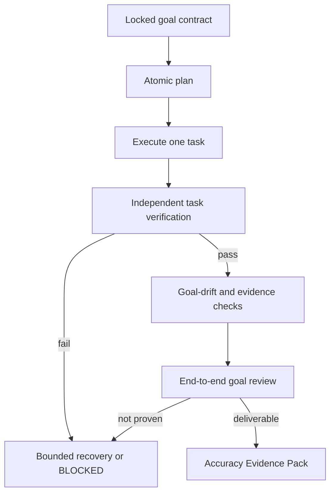

# Loop Engineering

**A deterministic runtime for executing a locked goal, verifying every task independently, recovering from failure, and delivering an evidence-backed result.**

Give it a goal contract. It plans atomic tasks, executes one at a time, verifies each result, checks for goal drift, resumes safely after interruption, and either ships an Accuracy Evidence Pack or stops with the exact unblock requirement.

## Try it in five minutes

Requires Python 3.11+.

```bash
git clone https://github.com/Abhillashjadhav/loop-engineering.git
cd loop-engineering
python -m venv .venv && source .venv/bin/activate
pip install -e ".[dev]"

# Offline deterministic demonstration
loop-engineering audit-github \
  --subjects examples/subjects.synthetic.yaml \
  --fixtures evals/fixtures/github

cat outputs/github-authority-audit-synthetic/accuracy-evidence.md
```

The bundled audit uses synthetic fixtures and is intended to demonstrate the runtime. It is not a live assessment of any person or repository.

## What the runtime guarantees

- **Locked goal:** the approved contract is digest-checked and cannot drift silently.
- **Atomic execution:** only one task runs at a time; pass conditions exist before execution.
- **Independent verification:** an executor cannot verify its own output.
- **Crash-safe resume:** verified work is preserved; executed-but-unverified work is repeated.
- **Bounded recovery:** retries, budgets, and circuit breakers prevent indefinite loops.
- **Honest completion:** interrupted, incomplete, or unsupported work cannot be delivered as success.
- **Evidence-backed output:** every completed run includes verification results, unresolved uncertainty, and a learning receipt.

The North Star is `human_active_minutes_saved_per_successfully_verified_goal`. Speed without verified completion does not count.

## How it works



A successful run produces:

- final output;
- task and event ledgers;
- per-task verification results;
- claim-to-evidence matrix;
- goal-drift and end-to-end review;
- unresolved uncertainties;
- Accuracy Evidence Pack and Learning Receipt.

## General workflow

```bash
loop-engineering init examples/goal.synthetic.yaml
loop-engineering plan github-authority-audit-synthetic --fixtures evals/fixtures/github
loop-engineering run github-authority-audit-synthetic --fixtures evals/fixtures/github
loop-engineering status <run-id>
loop-engineering verify <run-id>
loop-engineering report <run-id>
loop-engineering resume <run-id>
```

## Included use cases

### Public GitHub Authority Audit

A synthetic, evidence-policy demonstration used by CI. The repository-quality labels are experimental use-case outputs, not claims about private competence, intent, or exact human/AI authorship. Live retrieval is not performed by the deterministic Python runtime.

### Personal Chief of Staff

A private-data workflow for source-backed task discovery, prioritization, briefs, safe scheduling proposals, and approval-gated actions. Run the synthetic demo:

```bash
loop-engineering chief-of-staff status
loop-engineering chief-of-staff tasks
loop-engineering chief-of-staff brief morning
loop-engineering chief-of-staff schedule
```

See [`use_cases/personal-chief-of-staff/README.md`](use_cases/personal-chief-of-staff/README.md).

## Repository map

| Path | Purpose |
|---|---|
| `src/loop_engineering/contracts/` | Locked goal contracts |
| `src/loop_engineering/planning/` | Atomic planning and drift coverage |
| `src/loop_engineering/runtime/` | Engine, state, queue, budgets, checkpoints, circuit breakers |
| `src/loop_engineering/verification/` | Task, drift, evidence, stability, and end-to-end review |
| `src/loop_engineering/recovery/` | Failure routing and repair tasks |
| `src/loop_engineering/reporting/` | Metrics, evidence packs, and learning receipts |
| `src/loop_engineering/use_cases/` | Reusable use-case modules |
| `tests/` | Deterministic unit, failure, resume, and end-to-end tests |

## Validation

```bash
python -m pytest
ruff check src tests
ruff format --check src tests
python -m mypy
python -m build
```

CI runs the same quality gates and the offline synthetic demonstration.

## Current limitations

- The deterministic runtime does not fetch live web or GitHub data.
- The GitHub audit is an experimental example and should not be treated as a definitive judgment of a person.
- Stability variants share the deterministic scoring core; they test conclusion robustness, not ground truth.
- Live connectors for the Personal Chief of Staff are intentionally limited and approval-gated.

## Contributing

Focused pull requests are welcome. Include a reproducible failure or use case, deterministic tests, documented trade-offs, and an honest limitation statement. Never commit private data, credentials, or generated run outputs containing sensitive information.

## License

MIT.
