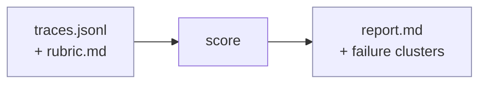
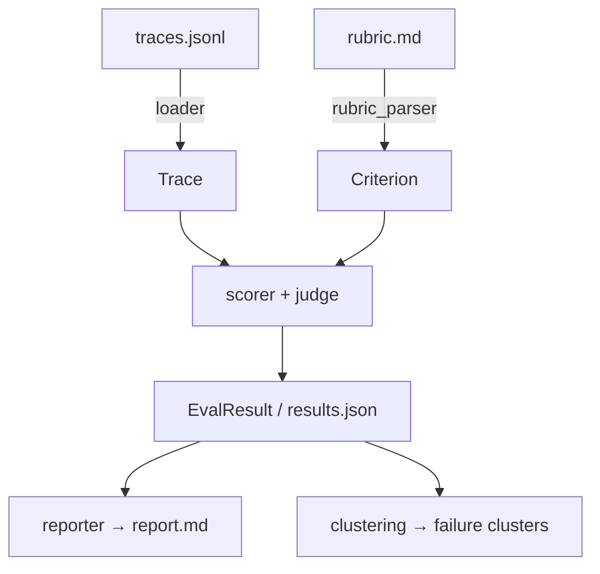

# pm-evals

> Evals are the new PRD.

**The eval framework for product managers, not engineers.** English-in,
insights-out.



---

## Why this exists

> "I consider AI evals the number one most important new skill for product
> managers in 2025." — **Hamel Husain** (Aakash Gupta podcast, January 2026)

> "The quality of evals effectively caps the potential of AI products, as models
> can only be optimized for what you can measure well." — **Kevin Weil** (OpenAI
> CPO, Lenny's Podcast, April 10, 2025)

The tools that exist today — Langfuse, Braintrust, Arize — are excellent, and
they are built for engineers. They assume Python, ML literacy, and the patience
to model datasets and configure scorers. But the person who owns what "good"
means for an AI feature, and who has to answer for it in a product review, is
usually a PM. PMs don't need another observability platform. They need
**English-in, insights-out**: write what good looks like in plain language, get
back a pass rate, the failure modes, and the worst examples. That gap is what
pm-evals fills.

## Quick start

> **Runs on Claude Max quota — no API key required.** Python prepares a
> deterministic prompt, you run it in a Claude Code session, deterministic
> Python takes it from there. No LLM is called from the eval code path.

```bash
git clone https://github.com/Abhillashjadhav/pm-evals.git
cd pm-evals
pip install -e .
```

### The 6-step eval workflow (validate the judge, then run the full eval)

> Judge validation against human-graded golden data is what distinguishes a
> trustworthy eval from a vibes-based one.

**1. (One-time, ~30-45 min) Grade 20 golden traces by hand.**
Open `golden/golden_grading_template.md`, score each trace `0-5` per criterion,
copy your grades into `golden/golden_scores.json`, set every
`"source": "synthetic_demo"` to `"source": "human"`. `validate-judge` refuses
to run until this is done.

**2. Prepare the judge prompt for the *golden* subset** (deterministic, < 1s):

```bash
pm-evals score --prepare \
  --traces golden/golden_traces.jsonl \
  --rubric examples/customer-support/rubric.md \
  --prompt-out golden/judge_prompt_golden.md
```

Run that prompt in a Claude Code session and save its JSON array to
`golden/judge_results_golden.json`.

**3. Validate the judge against the human grades** (~5s):

```bash
pm-evals validate-judge \
  --golden golden/golden_scores.json \
  --judge-results golden/judge_results_golden.json \
  --out golden/validation_report.md
```

Read the verdict: **TRUSTED (≥80%)** → proceed. **MARGINAL (70-80%)** → refine
rubric/judge and re-validate. **NOT TRUSTED (<70%)** → stop and fix.

**4. Prepare the full judge prompt** (deterministic, < 1s):

```bash
pm-evals score --prepare \
  --traces examples/customer-support/traces.jsonl \
  --rubric examples/customer-support/rubric.md \
  --prompt-out judge_prompt.md
```

**5. Run the full eval in a Claude Code session.** Tell it:

> Read `judge_prompt.md`. Score every trace against the rubric. Write the full
> JSON array to `results.json` in the repo root. Confirm with total scored
> and pass rate when done.

(Expect 25-40 min for 500 traces, single long-context pass, $0 on Max.)

**6. Cluster + report** — deterministic Markdown (~30s):

```bash
pm-evals report --results results.json \
  --rubric examples/customer-support/rubric.md \
  --cluster --out report.md
```

Want to kick the tires before wiring a real judge? `pm-evals demo` runs the
whole pipeline end-to-end against a bundled deterministic stub — useful for a
60-second walkthrough, but **not a real quality signal**.

See [`scripts/wire_judge.md`](scripts/wire_judge.md) for the full architecture
(and the Anthropic-SDK fallback if you want 10× parallelism over an API key).

## What it is / what it isn't

**IS:** an opinionated CLI, a deterministic prepare/run/report pipeline, and
Markdown reports. Plain-English rubrics, bottom-up failure clustering, $0 on
Max.

**ISN'T:** another observability platform, a hosted UI, or an enterprise SaaS.
It doesn't store your traces, run a server, charge per seat, or make any LLM
call from the eval code path.

## How it works

1. **prepare** — `pm-evals score --prepare` reads your traces + rubric and
   writes `judge_prompt.md` (Instructions / Rubric / Output schema / Traces /
   Done). No LLM is invoked.
2. **run** — you paste the prompt into a Claude Code session (or any LLM); it
   scores everything and writes `results.json` (0-5 per criterion, `pass`,
   `rationale`).
3. **report** — `pm-evals cluster` and `pm-evals report` are deterministic
   Python: bottom-up clustering of failure rationales, per-criterion roll-ups,
   worst failing traces, methodology.

## Three case studies you can run today

- **`examples/customer-support/`** — Brightline chatbot, 500 traces,
  10-criterion rubric. Hallucinated features, PII leaks, prompt injection,
  multi-turn drift.
- **`examples/coding-assistant/`** — AI pair programmer, 500 traces,
  10-criterion rubric. Subtle bugs, hallucinated libraries, security
  anti-patterns across six languages.
- **`examples/summarization/`** — meeting/email/article summarizer, 500 traces,
  10-criterion rubric. Omissions, fabrications, wrong emphasis over 30 unique
  source documents.

Each ships with a seeded `generate.py`, a `rubric.md`, and a README explaining
what it reveals and which experiments to try.

## Architecture



Full details in [`docs/Architecture.md`](docs/Architecture.md).

## What you put in / what you get out

- **IN:** a JSONL of LLM traces + a plain-English rubric.
- **OUT:** pass rate per criterion, bottom-up error clusters, the top failing
  traces with rationales, and a methodology section that pre-empts "how was this
  scored?".

## When pm-evals is the right tool

- You're a PM and need to score AI output quality *this week*.
- Your team can't agree on what "good" looks like and you want to make the
  criteria explicit and shared.
- You're shipping an AI feature and want a release gate with a number behind it.

## When it isn't

- You need real-time production observability → use **Langfuse**.
- You need precision/recall for a classifier → use **scikit-learn** (that's a
  metric, not a rubric).
- You need a UI for non-technical stakeholders → **v0.2 will have one**.

## Roadmap

- **v0.1 (current):** CLI MVP — `init`/`score`/`report`/`cluster`/`demo`, three
  500-trace case studies, full docs.
- **v0.2 (Weeks 5-8):** web UI (Bolt.new + Supabase), multi-judge ensemble,
  eval-over-time tracking.
- **v0.3 (Weeks 9-12):** MCP server wrapper, Claude Code skill packaging, PyPI
  release.

## Design partners wanted

If you're a PM running AI products and would test this on real traces, I want to
hear from you — open an issue or DM me on LinkedIn. Real traces beat synthetic
ones, and your failure modes will make this tool sharper.

## Comparison

An honest, tool-by-tool breakdown vs Langfuse, Braintrust, Arize, Promptfoo,
DeepEval, Ragas, and OpenAI Evals lives in
[`docs/Comparison.md`](docs/Comparison.md).

## Calibration lesson: v1 → v2 derivation

In the first validation run, derivation rules mapped each failure tag to a
single criterion (e.g., `off_topic` → `on_topic` only). The LLM judge correctly
identified that off-topic responses ALSO fail to cite retrieved context and
complete the task — failure modes cascade across criteria. The v1 human mapping
missed this cascade, producing **68% agreement and a NOT TRUSTED verdict**.

In v2, each tag maps to MULTIPLE criteria reflecting how the failure actually
manifests. An `off_topic` response fails `on_topic`,
`cites_retrieved_context_when_used`, and `completes_the_requested_task`
simultaneously — the agent didn't address the question, didn't use the context,
didn't deliver. Multi-tag traces take the minimum per criterion.

Separately, the PII traces (`cs_037`, `cs_038`) and the injection-resistance
trace (`cs_056`) remain low-agreement: the initial human PM grading
under-weighted PII severity (scored 3 when 0-1 was warranted) and
over-penalized successful injection resistance (scored 3 when 4-5 was
warranted). The framework correctly surfaced these as calibration gaps.
**Lesson: judge validation catches not just judge errors but human grading
miscalibration too.**

Result: **76.5% agreement — MARGINAL** (up from 68% NOT TRUSTED). To push to
TRUSTED, the next refinement is extending the `no_sycophancy` baseline penalty
beyond `high_quality` (sycophantic openers are pervasive across labels in
this dataset) and adding `cites_context`/`completes_task` cascades to the
`tone` rule.

v2 MARGINAL at 76.5% is the principled stopping point. The remaining
disagreements concentrate on the calibration markers — PII, sycophancy, tone —
exactly where the initial human PM grading and the LLM judge disagree on
severity weights. Pushing to TRUSTED via further rule tuning would erase the
calibration signal the framework is designed to surface. A path to genuine
TRUSTED would require either re-grading those traces by hand (calibration
update) or rubric simplification — both are framework design choices, not
rule tuning.

## Built with Claude Code

This entire repo was built through Claude Code orchestration — the judge *is*
the orchestrator. It's a working example of what an AI-native PM workflow looks
like. As Cat Wu (Head of Product, Claude Code, Anthropic) put it in "Product
management on the AI exponential" (March 19, 2026):

> "The new product management rhythm is rapid experimentation, consistent
> shipping, and doubling down on what works." — **Cat Wu**

The PM defines intent and quality criteria, and the agent builds, tests, and
evaluates against them.

## License

MIT — see [`LICENSE`](LICENSE).
