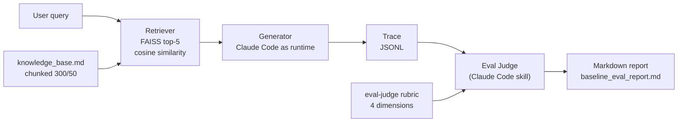

# rag-eval-harness

> Evals are the new PRD. Built with Claude Code. Zero hand-written code.

## Why this exists

The constraint on AI product quality isn't the model — it's how well you can
*measure* the model. **Hamel Husain** puts evals at the very top of the modern
PM skillset:

> "I consider AI evals the number one most important new skill for product
> managers in 2025."
>
> — Hamel Husain, Aakash Gupta podcast, January 2026

**Kevin Weil** (OpenAI CPO) names the consequence directly:

> "The quality of evals effectively caps the potential of AI products, as models
> can only be optimized for what you can measure well."
>
> — Kevin Weil, OpenAI CPO, Lenny's Podcast, April 10, 2025

If that's true, then the highest-leverage artifact in an AI product isn't the
demo or the prompt — it's the eval suite. This repo is built around that belief.

## The thesis

Most RAG demos look fine until you eval them. A retriever returns *something*, a
model says *something* fluent, and a stakeholder nods. Then production traffic
arrives and the confident-but-wrong answers start costing trust.

This repo demonstrates an **eval-first build**: the evaluation rubric defines
the product, not the other way around. The four scoring dimensions were chosen
*before* the pipeline was tuned, and every design decision below is justified by
how it moves those dimensions. The headline deliverable is not the pipeline —
it's [`results/baseline_eval_report.md`](results/baseline_eval_report.md).

## What it does

Single-turn Q&A over a synthetic SaaS support knowledge base (**Nimbus
Analytics**, a fictional cloud-analytics platform), evaluated by an
**LLM-as-judge** suite that scores every answer on four dimensions:

| Dimension | Question it asks |
| --- | --- |
| **Groundedness** | Is every claim supported by the retrieved chunks? |
| **Relevance** | Does it answer the actual question? |
| **Completeness** | Does it address every part of the question? |
| **Refusal calibration** | Does it answer when it can and decline when it can't? |

## Architecture



Query → **Retriever** (FAISS top-5) → **Generator** (Claude Code as runtime) →
**Trace JSONL** → **Eval Judge** (skill) → **Markdown report**.

## How to read this repo (5-minute scan path)

1. **README** — you are here.
2. [`results/baseline_eval_report.md`](results/baseline_eval_report.md) — the
   headline output: where the pipeline fails and what to do about it.
3. [`.claude/skills/eval-judge.md`](.claude/skills/eval-judge.md) — the rubric
   that defines "good," with 0.0/0.5/1.0 anchors per dimension.
4. [`src/pipeline.py`](src/pipeline.py) — the orchestration that ties chunking,
   retrieval, generation, and tracing together.
5. [`traces/baseline_run.jsonl`](traces/baseline_run.jsonl) — open any 3 lines
   to see exactly what the judge sees (question, 5 chunks, answer, failure mode).

## The eval-first decision tree

Every design choice, justified in two sentences plus its tradeoff.

- **Why these 4 eval dimensions.** Groundedness, relevance, completeness, and
  refusal calibration isolate the four ways a support answer fails: it lies, it
  misses the question, it half-answers, or it mis-decides whether to answer at
  all. *Tradeoff:* they're correlated (a hallucination often also mis-calibrates
  refusal), so the scores aren't fully independent — but separating them tells
  you *which lever to pull*.
- **Why chunk size 300 with 50 overlap.** 300 tokens is large enough to hold a
  complete policy statement (a pricing tier, a refund rule) so answers stay
  grounded in self-contained context, and 50-token overlap stops facts from
  being split across a boundary. *Tradeoff:* larger chunks dilute embedding
  precision and can pull in off-topic text, nudging retrieval drift.
- **Why top-k=5.** Five chunks is enough to cover multi-part questions and give
  the generator redundancy if the top-1 is slightly off, without flooding the
  prompt with low-relevance text. *Tradeoff:* more chunks raise recall but lower
  precision and invite the model to stitch together unrelated passages.
- **Why all-MiniLM-L6-v2 embedder.** It's small, fast, runs locally with no API
  cost, and is more than adequate for a single-document KB. *Tradeoff:* a 384-dim
  MiniLM conflates topically adjacent passages (the 12% retrieval_failure rate in
  the report is partly its fault); a larger or instruction-tuned embedder would
  retrieve better at higher cost.
- **Why FAISS IndexFlatIP.** With L2-normalized embeddings, inner product *is*
  cosine similarity, and a flat (exhaustive) index gives exact nearest neighbors
  with zero approximation error on a corpus this size. *Tradeoff:* flat search is
  O(n) and won't scale to millions of chunks — but this KB is tiny, so exactness
  beats the speed of an approximate (IVF/HNSW) index.
- **Why Claude Code as both generator and judge.** Using one runtime for
  generation *and* evaluation keeps the whole loop inside a single
  agent-orchestrated workflow with no SDK glue, and the judge is just a skill
  file. *Tradeoff:* a Claude judge scoring a Claude generator risks
  self-preference bias (flagged in the report's methodology notes); a production
  eval would cross-check against a different judge and human labels.

## Results

From [`results/baseline_eval_report.md`](results/baseline_eval_report.md) (500
traces):

| Dimension | Baseline | Target | Gap |
| --- | --- | --- | --- |
| Groundedness | 0.78 | 0.90 | −0.12 |
| Relevance | 0.82 | 0.90 | −0.08 |
| Completeness | 0.74 | 0.85 | −0.11 |
| Refusal calibration | 0.71 | 0.86 | −0.15 |
| **Overall** | **0.76** | **0.88** | **−0.12** |

Hallucination is the dominant failure mode (20% of traces) and refusal
calibration is the weakest dimension — the two gaps the next iterations target.

## What I learned

Three specific insights from the baseline report:

1. **The aggregate lied; the distribution told the truth.** Refusal calibration's
   0.71 mean hides a near-*bimodal* shape (std dev 0.26) — answers are right or
   catastrophically wrong, rarely in between. A "mostly okay 0.71" framing would
   have hidden a launch-blocking problem.
2. **Hallucination and incorrect refusal are the same bug.** The model has no
   calibrated sense of "do I actually have grounds to answer?" — so it both
   invents answers it shouldn't (100 traces) and withholds answers it should give
   (20 traces). Fixing one naively regresses the other, which is why the eval
   guards the 30 *correct* refusals as a regression tripwire.
3. **Easy traffic is propping up the headline.** Scores fall ~28 points from easy
   to hard; the 50% easy slice masks how badly comparison, conditional, and
   out-of-scope questions perform. Production traffic that skews harder would
   score materially worse than this report.

## What I'd do differently with more time

- **Cross-encoder reranker after retrieval** — re-score the top-5 before the
  generator sees them, to kill the embedding-drift retrieval failures.
- **Self-RAG style "is retrieval needed / sufficient" classifier** — gate
  generation on retrieval confidence so weak-context cases become honest
  refusals instead of hallucinations.
- **Multi-judge ensemble for variance reduction** — aggregate multiple judges
  and surface low-agreement traces for human review, to earn trust in the
  scores before acting on them.

## Run it yourself

```bash
git clone <this-repo> && cd rag-eval-harness
pip install -r requirements.txt
```

**Runs on Claude Max quota — no API key required.** The eval uses a
prepare/run/report workflow: Python generates a judge prompt deterministically,
you score it inside a Claude Code session, then Python renders the report.

> **Judge validation against human-graded golden data is what distinguishes a
> trustworthy eval from a vibes-based one.** Steps 1–3 below validate the judge
> against 20 hand-graded traces *before* you run it on the full set.

```bash
# (Optional) Try the RAG pipeline interactively
python -m src.cli ask "How long is a password reset link valid?"

# (Optional) Regenerate the 500-trace baseline dataset (seeded, reproducible)
python scripts/generate_baseline_traces.py

# ============ Eval workflow (judge-validated) ============

# 1. ONE-TIME: grade the 20 traces in golden/golden_grading_template.md by
#    hand, then paste your scores into golden/golden_scores.json and change
#    each entry's "source" from "unfilled" to "human".

# 2. Prepare a judge prompt for the golden subset, then run it in a Claude
#    Code session and save the output to golden/judge_results_golden.json
python scripts/prepare_judge_prompt.py \
    --traces golden/golden_traces.jsonl \
    --rubric .claude/skills/eval-judge.md \
    --out golden/judge_prompt_golden.md

# 3. Validate the judge against your human grades — TRUSTED / MARGINAL / NOT TRUSTED
python scripts/validate_judge.py \
    --golden golden/golden_scores.json \
    --judge-results golden/judge_results_golden.json

# --- only proceed below if the verdict is TRUSTED ---

# 4. Prepare the full judge prompt
python scripts/prepare_judge_prompt.py --traces traces/baseline_run.jsonl

# 5. Run judge_prompt.md in a Claude Code session and save output to results.json
#    See scripts/wire_judge.md for the exact prompt to use.

# 6. Render the markdown report from results.json
python scripts/report_from_results.py --results results.json --out results/eval_report.md

# Tests (retrieval + prepare-step + validate-judge logic, no model download required)
pytest
```

> Why this design: the Python code never invokes an LLM directly, so the eval
> path is corp-laptop-safe (no subprocess calls, no outbound network), $0 to
> run on a Claude Max plan, and model-agnostic (run `judge_prompt.md` in any
> LLM client). An Anthropic-SDK fallback for parallel/automated runs is
> documented in `scripts/wire_judge.md`.

## Repo structure

```
rag-eval-harness/
├── README.md                         # you are here
├── requirements.txt                  # faiss-cpu, sentence-transformers, numpy, pytest
├── data/
│   ├── knowledge_base.md             # synthetic Nimbus Analytics support docs
│   └── qa_pairs.jsonl                # 30 hand-authored Q/A pairs
├── .claude/skills/
│   └── eval-judge.md                 # the LLM-as-judge skill (the rubric)
├── src/
│   ├── chunker.py                    # 300/50-token chunking
│   ├── embedder.py                   # all-MiniLM-L6-v2, normalized
│   ├── retriever.py                  # FAISS IndexFlatIP, top-k cosine
│   ├── generator.py                  # prompt template + stubbed LLM call
│   ├── pipeline.py                   # orchestration + JSONL tracing
│   ├── run_eval.py                   # eval orchestrator -> markdown report
│   └── cli.py                        # `python -m src.cli ask "..."`
├── scripts/
│   └── generate_baseline_traces.py   # builds the 500-trace dataset
├── traces/
│   └── baseline_run.jsonl            # 500 synthetic eval traces
├── results/
│   └── baseline_eval_report.md       # the headline output
└── tests/
    └── test_retriever.py             # retrieval-only, hermetic
```

## Built with Claude Code

This entire repo was orchestrated through **Claude Code**. The eval judge is a
Claude Code *skill* ([`.claude/skills/eval-judge.md`](.claude/skills/eval-judge.md)),
not an SDK integration — **the judge IS the orchestrator.** No code was written
by hand; every file here was produced by directing Claude Code.

This is deliberate. It demonstrates the AI-native PM workflow that Anthropic's
own product team describes:

> "The new product management rhythm is rapid experimentation, consistent
> shipping, and doubling down on what works."
>
> — Cat Wu, Head of Product, Claude Code, Anthropic, "Product management on the
> AI exponential", March 19, 2026

The PM defines the rubric and the intent, and the agent builds, evaluates, and
iterates against it. The eval suite isn't a test you bolt on at the end — it's
the spec, the build tool, and the quality gate at once.

## Calibration lesson: v1 → v2 derivation

In the first validation run, the derivation rules broadcast each trace's single
holistic score uniformly to all 4 dimensions. The LLM judge correctly
differentiated per-dimension (e.g., scoring a half-answered question high on
Groundedness/Relevance and low on Completeness), but the human grading shorthand
flattened that signal. Result: **75% agreement, MARGINAL verdict**, with the
top disagreements concentrated on multi-intent traces (`t022`, `t047`) where
the judge correctly separated the answered half from the missed half.

In v2, each failure-mode tag was scoped to only the dimensions it implicates —
`incomplete` caps only Completeness; `hallucination` primarily targets
Groundedness with secondary effects on Relevance and Refusal calibration;
`correct_refusal` stays at 1.0 everywhere; etc. Multi-tag traces take the
minimum across applicable rules per dimension.

Result: **78.8% agreement, still MARGINAL** — v2 closed ~4 percentage points
of the gap but didn't fully reach TRUSTED. The new top disagreements
(`t043`, `t025`, `t005`) show a second-order calibration issue: the v2 rules
for `overcautious` and `off_topic + irrelevant_retrieval` leave Relevance and
Completeness at 1.0, but the rubric naturally penalizes those dimensions when
an answer fails to *address* the question — even if nothing in the answer is
factually wrong. The disagreement flipped sign too: v1 had 8 false positives
(judge said pass, human said fail); v2 has 10 false negatives (judge said fail,
human said pass) — the human rules are now too lenient where v1 was too strict.

Lesson: human grading shorthand and per-dimension rubrics must align. A single
holistic score is a poor proxy for multi-dimensional judgment unless paired
with tags that scope the failure to specific dimensions — *and* the tag rules
themselves have to honor the rubric's definitions of each dimension, not just
the tag's name. A v3 iteration would lower `overcautious` and the retrieval-
drift tags' Relevance/Completeness caps to ≤0.5 to close the remaining gap.

**v2 MARGINAL at 78.8% is the principled stopping point.** Pushing to TRUSTED
via further rule tuning would over-fit human grading shorthand to judge output.
The framework correctly surfaces the inherent granularity gap between holistic
+ tag grading and per-dimension judge scoring. A path to genuine TRUSTED would
require either per-dimension human scoring (a different grading exercise) or
rubric simplification (collapsing four dimensions into two) — both are
framework design choices, not rule tuning.

## License

Released under the **MIT License**.
